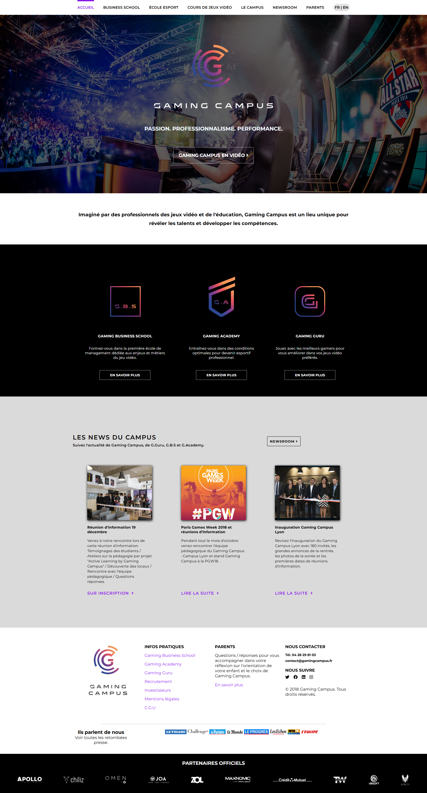

# Integration Gaming Campus

Intégration HTML/CSS du site Gaming Campus.  
Le site n'est pas responsive pour l'instant. **Work in progress.**

## Objectifs

- [ ] Rendre le site **responsive** pour tous les écrans
- [ ] Ajouter des **animations sur les boutons** et interactions
- [ ] Améliorer la mise en page pour plus de fluidité
- [ ] Optimiser l'utilisation des images et assets

## Structure du projet

- `index.html` : page principale du site
- `style.css` : feuille de style CSS
- `assets/` : images, logos et fonts utilisés
- `screenshots/` : capture d'écran du projet
- `README.md` : ce fichier

## Screenshot

## Notes

- Ce projet est une intégration statique.
- Les éléments interactifs (boutons, navigation) ne sont pas encore fonctionnels.
- Le site sera amélioré progressivement selon les objectifs listés.cd