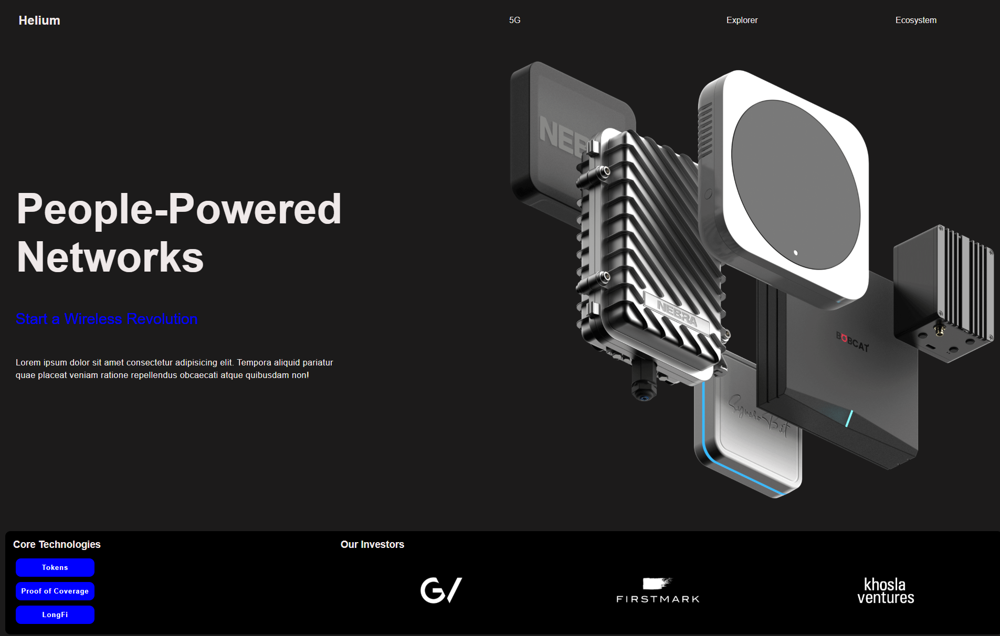

# 🌐 Intégration Hélium

Une intégration front-end réalisée en **HTML5 / CSS3**, inspirée du site Helium.  
L’objectif de ce projet est de pratiquer la mise en page moderne (Flexbox, Grid) et de commencer à aborder la **responsivité** via des media queries.

---

## 🚀 Aperçu
### Capture d’écran
Vue complète du site :  

---

## 🛠️ Technologies utilisées
- HTML5 (sémantique de base)  
- CSS3 (Flexbox, Grid, Media Queries)  
- Fonts custom (Inter)  
- Gestion d’assets (images, polices)  

---

## 📂 Structure du projet
Integration-Helium/
├── assets/ # images et polices
├── screenshots/ # captures d’écran
├── index.html # page principale
├── style.css # styles globaux
└── README.md # documentation du projet

---

## 📱 Responsivité
- ✅ Version desktop (mise en page fixe).  
- ✅ Premiers breakpoints avec **media queries**.  
- ⚠️ Encore perfectible : certains ajustements responsives sont à améliorer.  

---

## ✨ Améliorations prévues
- [ ] Finaliser la responsivité pour mobile et tablettes.  
- [ ] Optimiser la typographie et les espacements.  
- [ ] Ajouter des animations et transitions pour améliorer l’expérience utilisateur.  

---

##  Auteur
Projet réalisé par *Jedobah* dans le cadre de son portfolio de développeur front-end.  