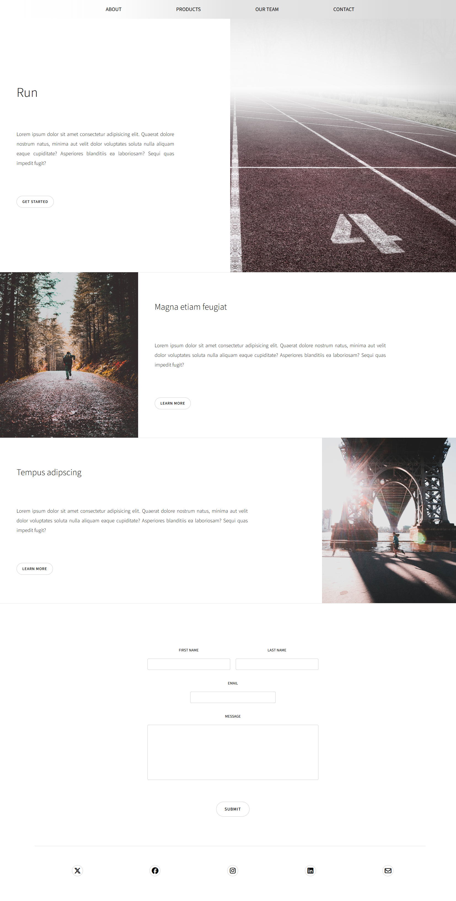

# RUN

Landing page responsive avec sections de présentation, formulaire de contact et intégration des icônes sociales.

---

##  Aperçu
### Capture d’écran
Vue complète du site :  

---

## Contenu

Navigation : menu simple avec fondu dans l'image du header contenant les liens (About, Products, Our Team, Contact).

Header : titre, description, image-banner à droite et bouton d’appel à l’action.

Sections principales :

Section 1 : présentation avec image à gauche .

Section 2 : présentation avec image à droite.

Contact : formulaire avec champs nom, email, message et submit.

Footer : icônes réseaux sociaux.

---

## Technologies

HTML5

CSS3 (flexbox, grid, responsive design, media queries)

Font Awesome (icônes sociales)

Typographie personnalisée via @font-face tirée de Google Font.

## Installation

Cloner le dépôt :

git clone <https://github.com/Jedobah/Integration-Run.git>

---

## Structure des fichiers

 index.html
 
 style.css

screenshots

README.md

 

assets 
             
    

-  img  
   
   ° banner.jpg  
   
   ° left.jpg  
   
   ° img-right.jpg  

- font  
  
  ° SourceSans3-VariableFont_wght.ttf  

---

> **Note**  
> La police Source Sans est chargée localement.  
> Le projet est statique, aucune dépendance externe autre que Font Awesome.

---

## Auteur

Projet réalisé par **Jedobah** dans le cadre de son portfolio de développeur front-end.  

